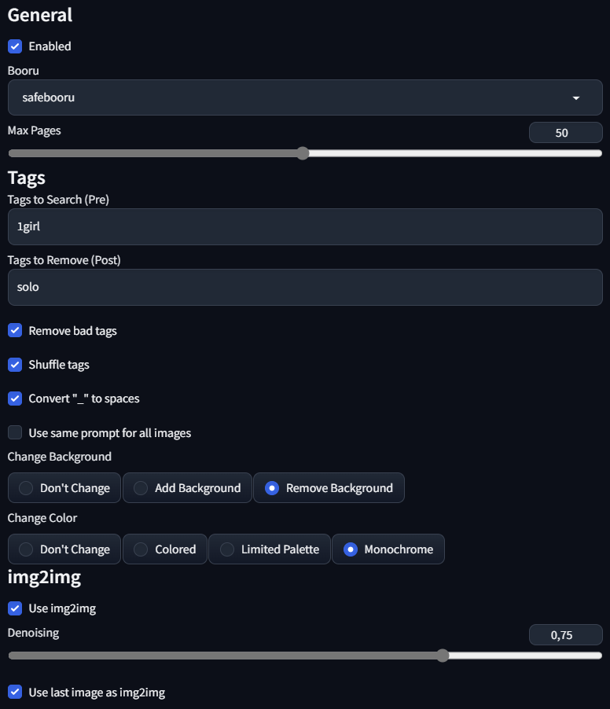
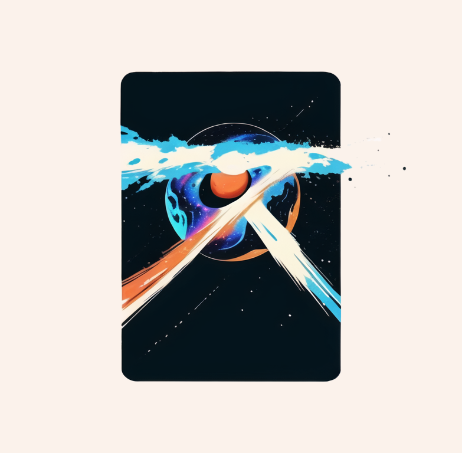

# Ranbooru

Ranbooru is an extension for the [automatic111 Stable Diffusion UI](https://github.com/AUTOMATIC1111/stable-diffusion-webui). The purpose of this extension is to add a panel that gets a random set of tags from boorus pictures. This is mostly being used to help me test my checkpoints on a large variety of tags.

## Installation
Just copy the script from the scripts folder above into the extensions folder of your 1111automatic installation. Then restart 1111automatic, by clicking the "Reload UI" button on the bottom of the page.
To run the extension just scroll down in the txt2img or img2img panel to the script selection and select Ranbooru.

## Features
The extension has a few features implemented right now.
Here's an explanation of all the parameters:
- **Enabled**: Enables the extension
- **Booru**: The booru to get the tags from. Right now only Gelbooru, Rule34 and Safebooru are implemented. You can easily add more creating a class for the booru and adding it to the booru list in the script.
- **Max Pages**: The maximum amount of pages to get the tags from. The extension will get a random page from the booru and then get the tags from one or more random pictures from that page.
- **Post ID**: Here you can specify the ID of the post to get the tags from. If you leave it blank, the extension will get a random post (or more than one) from the random page.
- **Tags to Search (Pre)**: This add the tags you define (separated by commas) to the search query. This is useful if you want to get tags from a specific category, like "1girl" or "solo".
- **Tags to Remove (Post)**: This remove the tags you define (separated by commas) from the result query. This is useful if you want to remove tags that are too generic, like "1girl" or "solo".
- **Remove Bad Tags**: This remove tags that you usually don't need (watermarks,text,censor)
- **Shuffle Tags**: This shuffle the tags before adding them to the text.
- **Convert** "\_" to Spaces": This convert \_ to spaces in the tags.
- **Use the same prompt for all images**: This use the same prompt for all the generated images in the same batch. If not selected, each image will have a different prompt.
- **Change Background**: This tries to change the background of the parsed tags by adding or removing specific tags
- **Change Color**: This tries to change the color of the parsed tags by adding or removing specific tags
- **Use img2img**: This uses not only the tags from the random image, but also the original picture to generate the final result.
- **Denoising Strength**: This is the strength of the denoising filter. The higher the value, the more the picture will change from the original.
- **Use last image as img2img** This uses the same picture for all the img2img generations in the same batch.

## Found an issue?
If you found an issue with the extension, please report it in the issues section of this repository.
---
## Made by Inzaniak
 

If you'd like to support my work feel free to check out my Patreon: https://www.patreon.com/Inzaniak

Also check my other links:
- **Personal Website**: https://inzaniak.github.io 
- **Deviant Art**: https://www.deviantart.com/inzaniak
- **CivitAI**: https://civitai.com/user/Inzaniak/models